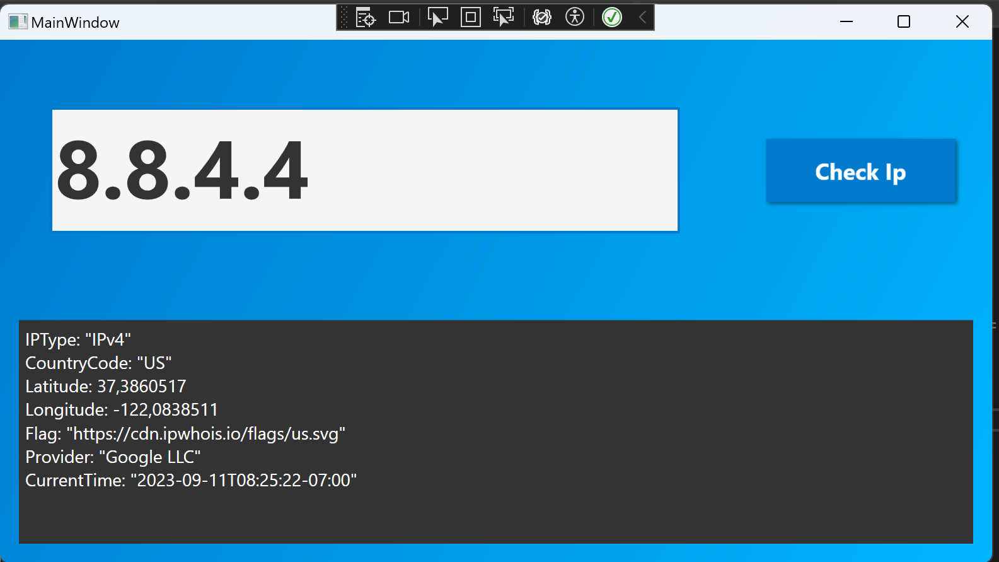

# IP Checker App

This is a simple application that allows you to retrieve basic information about a given IP address.

## Description

The application uses an API to fetch data about the IP address and displays the following information:

- IP address type
- Country code
- Latitude and longitude
- Country flag
- Provider
- Current time in the IP address timezone

## Requirements

To run the application, you will need the following:

- .NET 7 SDK (or later version)
- Internet connection to fetch data from the API

## Installation and Usage

1. Clone the repository or download the source code of the application.

2. Open the project in your favorite Integrated Development Environment (IDE).

3. Make sure you have the .NET 5 SDK installed.

4. Build and run the application.

## Usage

1. Enter an IP address in the text field.

2. Click the "Get Information" button.

3. The application will send a request to the API and display the retrieved information about the specified IP address.

## Dependencies

The application uses the following dependencies:

- Newtonsoft.Json (version 13.0.1) - for working with JSON data.
